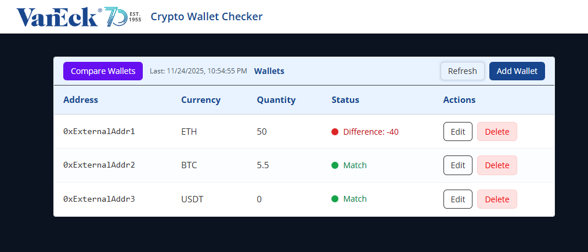

# crypto_wallet_checker



[](https://coveralls.io/github/saladuit/Crypto_Wallets?branch=main) [](https://github.com/saladuit/Crypto_Wallets/actions/workflows/ci.yml)

[Live Demo](https://crypto-wallets-frontend.onrender.com/) · [Backend API](https://crypto-wallets.onrender.com/)

A demo full-stack app that mocks interactions with a crypto-wallet API/store for demonstration purposes.

**Project Structure**
- `backend/` — FastAPI app, DB layer, CRUD, models, routes, and tests.
- `frontend/` — React app.

Inside `backend/`:
- `crud/` — high-level DB operations used by routes/services.
- `db/` — SQLAlchemy DB definitions and helpers.
- `models/` — Pydantic/ORM models
- `routes/` — FastAPI route handlers.
- `services/` — business logic and external API wrapper(s).
- `app.py` — FastAPI application and route registration.

**Setup**
1. Create and activate a Python venv and install backend deps:

```bash
python3 -m venv backend/.venv
source backend/.venv/bin/activate
pip install -r backend/requirements.txt
```

2. Start the backend:

```bash
uvicorn backend.app:app --reload --port 8000
```

3. Start the frontend:

```bash
cd frontend
npm install
npm run dev
```

**Usage**
- Visit `http://localhost:8000/wallets` to get to show stored wallets.
- Visit `http://localhost:8000/docs` for interactive API docs.

**Tests**
- Run tests from the project root:

```bash
pytest -q --cov --cov-branch --cov-report=html
```

***Test setup notes***
  - `backend/tests/conftest.py` configures an in-memory SQLite database for tests using:
  - `SQLALCHEMY_DATABASE_URL = "sqlite:///:memory:"` with `connect_args={"check_same_thread": False}` and `poolclass=StaticPool` so the same in-memory DB is accessible across threads/connections.
  - The fixture creates the schema once for the test session (`Base.metadata.create_all(bind=engine)`), yields, then drops it at teardown.
  - The `client` fixture overrides the app's `get_db` dependency so route handlers in tests use the test session.

**Deployment (Render)**

- Live: `https://crypto-wallets-frontend.onrender.com/` (frontend) and `https://crypto-wallets.onrender.com/` (backend).

- Quick note: both services are hosted on Render's free tier. Free instances sleep after inactivity, so the first request after a sleep can take a long time (+/- 50 seconds) while the instance wakes. Because the frontend needs the backend, you may see failed requests until the API is awake.
